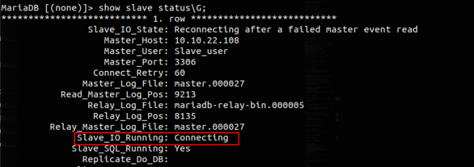

# Giới thiệu
Với các cơ sở dữ liệu có nhu cầu lưu trữ lớn thì đòi hỏi về tính toàn vẹn, không bị mất mát dữ liệu trước những sự cố ngoài dự đoán là rất cao. Vì vậy, người ta nghĩ ra khái niệm replication – nhân bản. Đây là một tính năng cho phép bạn tạo một phiên bản cơ sở dữ liệu giống hệt cơ sở dữ liệu đang tồn tại, và lưu trữ ở một nơi khác, đề phòng có sự cố.

Server chứa dữ liệu gốc được gọi là Master, server chứa dữ liệu nhân bản được gọi là Slave. Quá trình nhân bản từ master sang slave gọi là replication.

Bạn có thể kiểm soát dữ liệu cần sao chép. Tất cả các cơ sở dữ liệu, một hoặc nhiều cơ sở dữ liệu hoặc các bảng trong cơ sở dữ liệu đều có thể được sao chép có chọn lọc.

# Ưu điểm của việc sử dụng Replication
- Khả năng mở rộng – Scalability: Bằng cách có một hoặc nhiều server slave, việc đọc có thể được trải rộng trên nhiều server, giảm tải cho master. Kịch bản phổ biến nhất cho môi trường đọc cao, viết thấp là có một master, trong đó tất cả các ghi xảy ra, sao chép thành nhiều slave, xử lý hầu hết các lần đọc.

- Phân tích dữ liệu – Data analysis: phân tích dữ liệu có thể ảnh hưởng nhiều đến master server do đó ta có thể sử dụng slave server để phân tích dữ liệu mà vẫn đảm bảo master server hoạt động bình thường.

- Hỗ trợ sao lưu – Backup assistance:
- Phân phối dữ liệu – Distribution of data: Thay vì được kết nối với một master server từ xa, ta ó thể sao chép dữ liệu cục bộ và làm việc từ dữ liệu này.


# Hoạt động của Master – Slave

Cơ chế chính được sử dụng trong replication là binary log – nhật ký nhị phân . Nếu ghi nhật ký nhị phân được bật, tất cả các cập nhật cho cơ sở dữ liệu (thao tác dữ liệu và định nghĩa dữ liệu) được ghi vào nhật ký nhị phân dưới dạng các sự kiện binlog. Các slave đọc nhật ký nhị phân trên master để truy cập dữ liệu để sao chép. Một relay log – bản ghi tiếp được tạo ra trên slave server, sử dụng định dạng giống như các bản ghi nhị phân, và điều này được sử dụng để thực hiện sao chép.  Khi không còn cần thiết, các relay log file cũ sẽ được gỡ bỏ.


Một slave server sẽ theo dõi vị trí của sự kiện binlog cuối được ghi trong file nhật ký nhị phân của master dựa trên tham số “position”. Điều này cho phép slave server kết nối lại và tiếp tục lại từ nơi nó đã dừng lại ban đầu. Nó cũng cho phép một slave ngắt kết nối, tạo nhân bản và sau đó slave mới tiếp tục replication từ cùng một master.


Master và Slave không cần kết nối liên tục với nhau. Bạn có thể để server offline hoặc ngắt kết nối khỏi mạng và khi chúng quay lại hoạt động thì quá trình replication sẽ bắt đầu từ nơi nó dừng lại.

Chi tiết quá trình thực thi trong Replication như sau:


Chi tiết quá trình thực thi trong Replication

## Trên Master
Đầu tiên master phải ghi các sự kiện nhân bản vào một tập tin log đặc biệt gọi là binary log. Sau đó các slave sẽ đọc dữ liệu nhân bản từ tập tin này.


Bất cứ khi nào slave kết nối với master, master sẽ tạo một luồng kết nối mới( Binary Log Dump Thread) và thực hiện các hành động mà slave yêu cầu. hread này có thể được nhận ra bằng cách sử dụng câu lệnh SHOW PROCESSLIST và tìm thấy nó ở nơi có thread command là "Binlog Dump". Bạn có thể biết được slave nào đang được kết nối đến master bằng cách sử dụng câu lệnh SHOW SLAVE HOSTS .

Các slave bị chậm trễ có thể đọc các sự kiện được lưu trong bộ nhớ cache của hệ điều hành trên master chứ không đọc trên bộ nhớ vật lý của master. Tuy nhiên, khi một slave được kết nối sau đó vài giờ, thậm chí là vài ngày, nó sẽ bắt đầu đọc các sự kiện được ghi trên tập tin binary log – khi đó việc đọc được thực hiện trên bộ nhớ vật lý vì bộ nhớ cache không còn lưu trữ dữ liệu cần thiết.


## Trên Slave
Khi quá trình nhân bản được khởi động, có 2 luồng chạy trên slave:

- Luồng nhập xuất(I/O thread): Kết nối với master, đọc các sự kiện trong binary log và sao chép vào tập tin relay log.
	Mặc dù chỉ có một luồng đọc binary log từ master và một luồng ghi vào relay log trên slave, rất hiếm khi sự kiện sao chép làm cho quá trình nhân bản chậm đi. Quá trình này chỉ kéo dài khoảng vài trăm mili giây. Sử dụng lệnh show master status\G để kiểm tra luồng nhập xuất hiện hành:
	
	– Master_Log_File: tập tin cuối cùng được sao chép từ master (hầu như là giống với binary log cuối cùng được tạo ra bởi master)
	– Read_Master_Log_Pos : binary log của master được sao chép vào relay log trên slave đến vị trị hiện tại
	
	So sánh với cùng lệnh này ở máy master.

- Luồng SQL(SQL Thread): đọc các sự kiện từ relay log được lưu trữ cục bộ trên slave (tập tin được ghi bởi luồng IO) và thực thi các sự kiện đó nhanh nhất có thể.


Để xem trạng thái của luồng SQL, thực thi lệnh show slave status\G:

– Relay_Master_Log_File : tập tin binary log trên master mà luồng SQL đang đọc (thực ra là đọc trên relay log)

– Exec_Master_Log_Pos: vị trí trên file binary log nơi được thực thi bởi luồng SQL.


# Các Test Case cho MariaDB Master-Slave
Với cơ sở dữ liệu, nhu cầu lưu trữ lớn, đòi hỏi cơ sở dữ liệu toàn vẹn, trường hợp gặp những sự cố ngoài dự đoán là rất cao sẽ làm mất mát dữ liệu. Vậy một số sự cố thường gặp và cách khắc phục nó ra sao?


Trong bài viết dưới đây mình sẽ trình bày một số sự cố đó và cách khắc phục trong quá trình vận hành MariaDB Master-Slave.

## 1. Node Failed
### 1.1 Master Failed

*Mô tả*

Test với trường hợp tắt node master, sau vài phút bật lại. 
Insert và update một số bản ghi và kiểm tra sự đồng bộ giữa 2 nodes.

*Quy trình thực hiện*

Tạo một Table mới trong database Replica_db tên Test1 , insert vài bản ghi đơn giản , Slave đồng bộ bình thường.

```
> create table Test1 (id int primary key, name varchar(20));
```

Tắt node master, trên Slave show slave status thì thấy lỗi không kết nối được đến Node Master



Sau 5 phút, khởi động lại Node Server. Insert và update 1000 bản ghi vào table Test trong database Replica_db.

*Kết quả*

Dữ liệu trên Master và Slave đồng bộ với nhau và không bị thất thoát dữ liệu.


### 1.2 Slave Failed

*Mô tả*
Test với trường hợp tắt node Slave, sau vài giây bật lại.

Insert và update một số bản ghi và kiểm tra sự đồng bộ giữa 2 nodes khi service MariaDB bất ngờ bị stop trong quá trình insert dữ liệu.

*Quy trình thực hiện*

Tạo table Test trong database Replica_db

```
> create table Test (id int primary key, name varchar(20));
```

Tạo Script đơn giản để insert 2000 bản ghi vào Node Master và thực thi:

for i in {1..2000}; do
mysql -uroot -ppass -e "use replica_db; INSERT INTO Test (id, name) VALUES ($i, 'test');"
done

Trong quá trình chạy, đột ngột tắt Node Slave.

Bật lại Node Slave.

*Kết quả*
Slave database tiếp tục pull dữ liệu từ master về tính từ thời điểm Slave gặp sự cố.


### 1.3 Promoting a Slave to Master
*Mô tả*

Giả lập Master bị hỏng

Chuyển node slave thành node master tạm thời

Sau khi dựng lại node master cũ, đưa node master cũ trở về master, node master tạm thời trở lại về node slave


*Quy trình thực hiện*

Master hỏng và không thể khôi phục hoạt động.

Chuyển Node Slave thành Node Master bằng cách :
- Vào file `/etc/my.cnf` bỏ dòng read-only=1
- Đăng nhập vào Slave Database và xóa cấu hình slave cũ bằng câu lệnh :

```
> stop slave;
> reset slave all;
#systemctl restart mariadb
```

> Trỏ app về địa chỉ IP của Master tạm thời đó.


Hệ thống tiếp tục hoạt động bình thường. 
Khi Master cũ đã sẵn sàng hoạt động, trả lại Role Master cho Server đó bằng cách :

- Vào Master tạm thời, dump lại database đồng bộ để đảm bảo không mất mát dữ liệu ra file backup.sql
- Import backup.sql vào Master cũ và lấy các thông số về Master_log_file và master_log_pos
- Master tạm thời lại chuyển thành slave bằng việc set read-only trong file /etc/my.cnf và chạy các câu lệnh:

```
change master to master_host='10.10.22.xxx',
 master_user='slave',
 master_password='XXXXXXX',
 master_port=3306,
 master_log_file='master.00000x',
 master_log_pos=xxx,
 master_connect_retry=10;
 > start slave;
 ```


Sau khi xong, kiểm tra lại trên slave Database bằng câu lệnh
```
show slave status\G;
```

Thử insert vài bản ghi trên Master để kiểm tra.

*Kết quả*

Hệ thống vẫn hoạt động cho khi Node Slave chuyển sang Master. Việc thay đổi Role này khá đơn giản và nhanh, đáp ứng được yêu cầu đề ra về tính sẵn sàng và đảm bảo dữ liệu.

### 1.4 Backup/Restore khi hệ thống Master Slave gặp sự cố

Khi master gặp sự cố mất mát dữ liệu (record, Table, Schema v.v..) dẫn đến việc Slave cũng đồng bộ theo và khiến cho dữ liệu hệ thống mất đi.

Sử dụng bản backup gần nhất để khôi phục dữ liệu trên Master và kiểm tra xem Slave có đồng bộ lại không hay sẽ phải import lại CSDL trên Slave như khi mới khởi tạo Master-Slave


*Quy trình thực hiện*

Sử dụng câu lệnh sau để backup dữ liệu

```
# mysql
mysqldump -u root -p [dbname] > [backupfile.sql]
```

Trong đó :

- [dbname] : Tên của database
- [backupfile.sql] : Tên file backup muốn lưu

Sử dụng câu lệnh sau để restore dữ liệu

```
# mysql
mysql -u root -p [dbname] < [backupfile.sql]
```

Sử dụng các binary logs để tiếp tục restore Incremental (cần phải xem binary log file để xem thời điểm chính xác).

```
mysqlbinlog master-bin.000001 master-bin.000002 master-bin.000003 | mysql -uroot -p$pass
```

*Kết quả*

2 table usergroup và usergrouprole đã được khôi phục.

Dữ liệu của Database đã được phục hồi đến thời điểm trước khi bị mất dữ liệu.

Chúc mọi người thành công !

